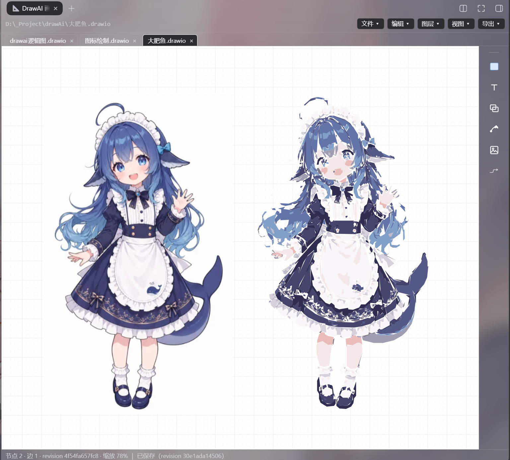
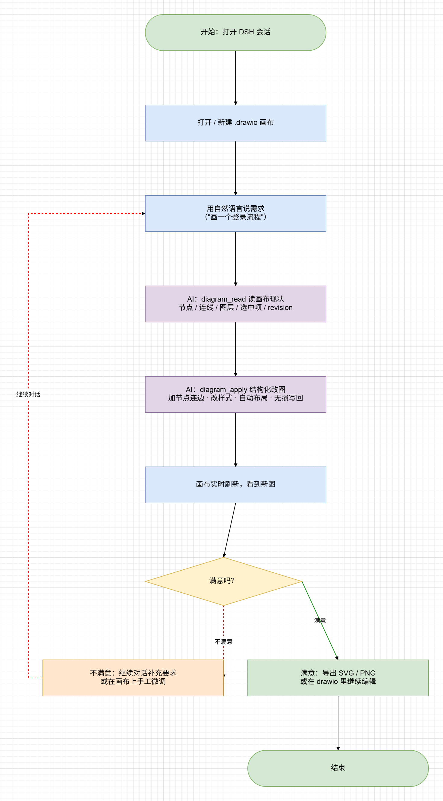
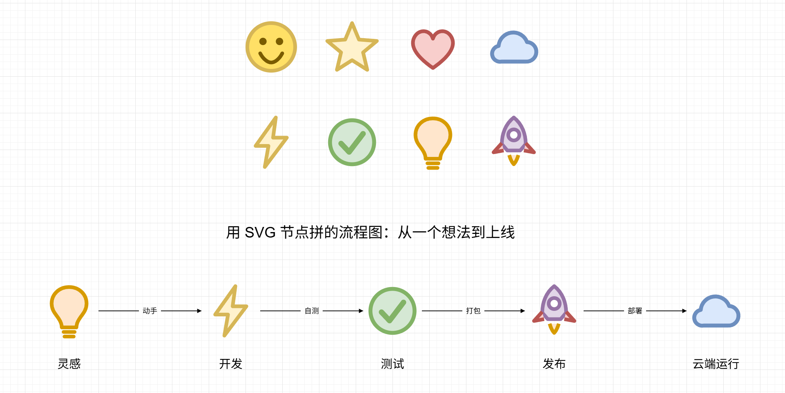
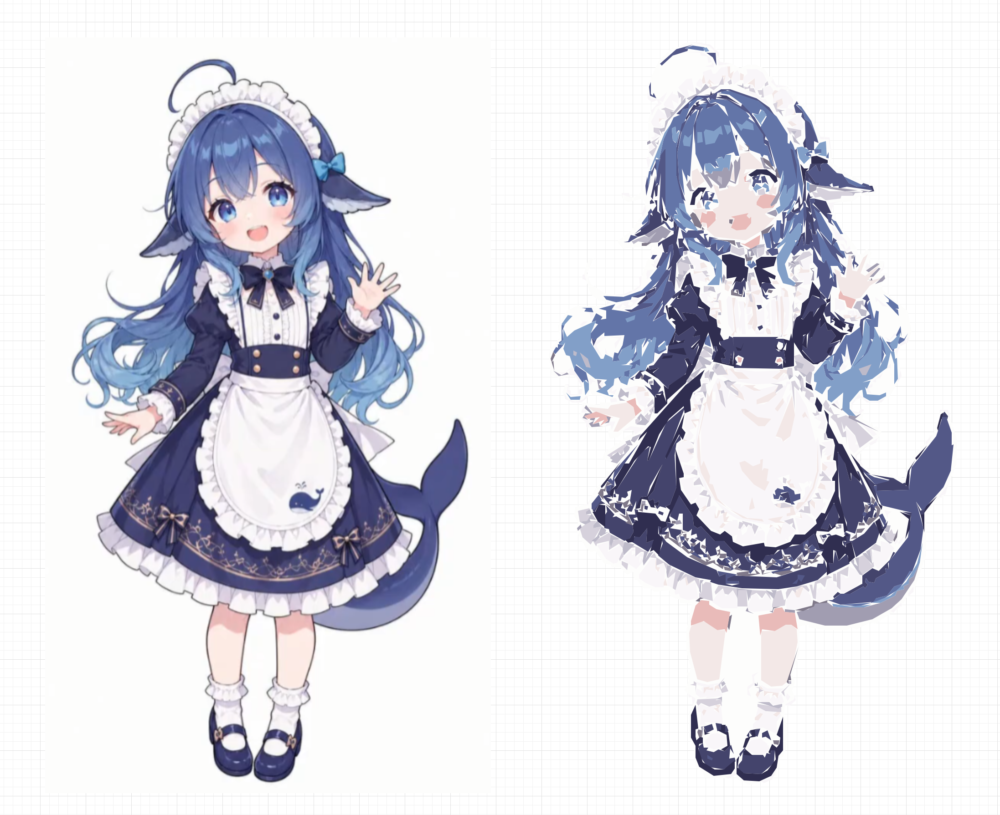

<!-- 待补：社交预览图。放好 docs/social-preview.png（1280×640）后，把下面这行的注释去掉即可。

-->

# dsh-drawai

[](https://github.com/fourzkw/dsh-drawai) [](LICENSE)

## 功能一览

`dsh-drawai` 把可编辑画布放进 DeepSeek Harness 右侧栏，并给模型两个改图工具；人和 AI 读写的是同一份原生 `.drawio`。

1. **右侧栏可编辑画布** —— 打开 / 新建工作区 `.drawio`：画节点、连边、就地改字、分层、排序、对齐、导出；双击即可改标签。
2. **自然语言改图** —— 对话里说需求，模型用 `diagram_read` / `diagram_apply` 读现状、结构化改图、自动布局并原子写回。
3. **选区感知与回退** —— 你在画布上选中什么，模型就知道什么；模型改动最多可退 8 步。
4. **SVG 图形节点** —— 图标 / logo 可直接当节点内容，拼流程图与示意图。
5. **位图矢量化（`traceImage`）** —— 照着工作区图片逐像素描成 SVG 节点，不是凭印象手写近似图。
6. **原生 `.drawio` 载体** —— 无需导入导出；画布读不懂的单元逐字节保留，文件可直接用 drawio / diagrams.net 继续编辑。









## 安装 / Install

```sh
# 从 npm 安装（推荐：预构建，跳过 allowBuilds 构建授权）
dsh plugin --profile web add dsh-drawai

# 或者直接从 GitHub 装（仓库里没有 prepare 脚本，同样不需要构建）
dsh plugin --profile web add github:fourzkw/dsh-drawai
```

然后**重启 `dsh web`** —— 宿主侧只在启动时加载，这一步不能省。

> **更新到最新版**：`dsh plugin --profile web update dsh-drawai@latest`

重启之后，你会看到：

| 装好后的变化 | 出现在哪里 |
|---|---|
| 「DrawAI 画布」面板，负责打开 `**/*.drawio` | 右侧栏 |
| `diagram_read` / `diagram_apply` | 模型工具集 |
| `drawai-canvas` 技能 | 会话技能目录（模型按需取全文） |

- 两种装法都不需要 `allowBuilds` 构建授权：npm 包是预构建的；GitHub 源码包里 `lib/` 也已提交、没有 `prepare` / `postinstall` 脚本。
- 手动挂载的兜底写法，以及本地 link 的开发做法，见[设计文档的「安装」一节](docs/design.md#安装)。

## 使用 / Usage

一块画布、两个工具、一份文件：人改的、模型改的、drawio 改的，最后都落在同一个 `.drawio` 上。

| 入口 | 你能得到什么 |
|---|---|
| **右侧栏画布** | 打开或新建画布、画节点与连线、就地改字、图层、分区、顺序、多选对齐、查找、微移、多页切换、复制粘贴、导出 SVG / PNG（含导出选中） |
| **`diagram_apply`** | 让模型按 ops 改图：增删改、重接边、复制、排序、分层、导出；支持 `ids` 批量、`as` 别名、`expectRevision` |
| **`diagram_read`** | 让模型看见图的结构与样式、图层与父级、页面尺寸、你此刻的选区、文件指纹 `revision` |
| **选中与回退** | 你选中什么模型就知道什么；模型的每一轮改动都能在界面上退回去 |

## 🗂️ 画布面板 / The canvas panel

刚打开面板时它是**空的**（不会替你预开一张图）：用 `文件 → 新建画布…` 或 `文件 → 打开…`（列出工作区里所有 `.drawio`）开始。

| 功能 | 它解决什么问题 |
|---|---|
| **画布外观** | 矩形 / 圆角 / 椭圆 / 菱形 / 圆柱 / 文档 / **SVG 图形** / **位图** 等形状族（右侧元素条按族放置）、8 色调色板、白纸 + 网格、正交折线 + 障碍避让、明暗切换 |
| **SVG 图形节点** | 节点内容直接是一段 **SVG 标记**（图标 / logo / 示意图这种形状词汇表里没有的东西）：右键「SVG 内容…」贴进去即可，或让模型用 `addNode {shape:"svg", svg:"<svg viewBox…>…</svg>"}`。落盘是 drawio **原生**的图片形状（`shape=image` + `image=data:image/svg+xml,<百分号编码>`），所以 drawio 桌面版打开同样画得出来；标记只喂给 `<image>`（独立文档，脚本不执行、也不碰页面 DOM） |
| **内嵌位图** | 从剪贴板粘贴或拖入 PNG / JPEG / GIF / WebP，画布会**真的画出来**（同为 `shape=image` + data URI）。`diagram_read` 把 base64 省略成 `«image N 字符»`，不撑爆上下文 |
| **位图矢量化 traceImage** | 让模型照着工作区里一张图**逐像素**描成 SVG 内容节点（读像素 → 泛洪去背景 → k-means 调色板 → 3× 超采样归类 → 按颜色取像素级闭合轮廓 → 每色一条 nonzero path）。形状词汇表表达不了的照片 / 插画走这条，而不是让模型手写一段近似 SVG 冒充复刻 |
| **文本** | 双击节点就地改字；「T 文字」放一段无边框、无底色的独立文字；字号有 10 / 12 / 14 / 18 / 24 五档，也可以手调 8–72；字色板 |
| **连线** | 四选一画法（直线 / 直角折线 / 圆角折线 / 曲线）× 线型（含虚线间距）× 箭头（单向 / 双向 / 无 / 反向）× 颜色 × 引出段长度；自环；悬空端（从节点脱开后成为自由端点，还能再拖回去） |
| **连线上的文字** | 双击改、按住拖（半格 + 贴线吸附）、右键「标签居中」；**线在文字的位置真的断开**（不盖白底） |
| **选中与移动** | 框选 / Shift 加选 / `Ctrl+A`；整体拖动（折点与自由端点跟着同一个位移走）；对齐辅助线；多选对齐与分布 |
| **图层** | 列出 / 新建 / 显示隐藏 / 锁定 / 重命名 / 删除（合并到邻层）/ 选中移层 / 设为当前层；隐藏与锁定写入文件 |
| **顺序** | 置顶 / 上移 / 下移 / 置底 —— 写回时**真的改动文件里单元的先后**（否则重新打开就变回去了） |
| **自定义数据** | 右键「编辑数据」，按 `key=value` 一行一项改单元属性；按 user object 存回文件，drawio 打开不会丢 |
| **导出** | SVG / PNG(2×)；「看一眼画布效果」走 DSH 附件服务，**不在工作区落文件** |
| **回退** | 「编辑 → 撤销 AI 改动」最多可以连着退 8 步 |

## 🤖 两个工具 / The two tools

### `diagram_apply` —— 模型怎么改图

结构化 ops，改完自动布局并**原子写回**（布局默认 `dagre-tb`，另有 `dagre-lr` / `grid` / `none`）：

| 类别 | ops |
|---|---|
| 增删 | `addNode` `addEdge` `remove` `duplicate` |
| 修改 | `setLabel` `setLabelPos` `setStyle` `setEdge` `move` |
| 结构 | `addLayer` `setLayer` `setLayerProps` `order` |
| 交互 | `highlight`（让画布替你选中，不改文档、不重排） |
| 输出 | `export`（`svg` 落在 `.drawio` 旁边；`png` 走浏览器下载） |
| 图像 | `traceImage`（把工作区里一张位图**逐像素**矢量化成 svg 内容节点） |

- **批量修改**：`setStyle` / `setLabel` / `move` / `remove` 都接受 `ids:[…]`，不必发 N 个 op。
- **`expectRevision`**：把上次 `diagram_read` 返回的 `revision` 传进来 —— 对不上（说明你在 drawio 里同时改过）就**报错，且一个字节都不写**，重读再改。
- **写盘之前就报错**：边引用了不存在的节点会直接失败，并列出已知 id。
- **不动手工摆好的版面**：ops 里自带几何时（`addNode` 给了 `x/y`，或者有 `move`）不会重排 —— 否则"挪 40px"会被布局立刻冲掉。
- **画图形用 `svg`**：`addNode {shape:"svg", svg:"<svg viewBox…>…</svg>", w, h}` 让节点内容就是那段标记（`setStyle {id, svg:"…"}` 换图、`svg:null` 清掉回到矩形）。标记**必须带 `viewBox`**，否则放大缩小时图形不会跟着变；缺 `xmlns` 宿主会补。
- **照着一张位图描矢量图用 `traceImage`**：

  ```
  diagram_apply({ op:"traceImage", image:"refs/角色.png", x:40, y:40 })
  ```

  它**真的去读那张图的像素**，在宿主里跑一条完整管线：

  | 步骤 | 做什么 |
  |---|---|
  | ① 解码 | PNG 走**自带解码器**（零依赖，只用 `node:zlib`）；JPEG/GIF/WebP 需要宿主装了 sharp |
  | ② 去背景 | 从四边泛洪，把近白/近灰/透明像素排除（不画截图底色；与边界不连通的白围裙不会误删） |
  | ③ 调色板 | k-means（K 默认 12，k-means++ 初始化，多次重启取最优）；背景单独占一色 |
  | ④ 归类 | 3× 双线性超采样 → 3×3 众数滤波 → 降回原分辨率 → 小于 `minArea` 的碎块并进**颜色最接近**的邻色 |
  | ⑤ 轮廓 | 按颜色分 4 连通域，沿**像素格边**建"区域恒在左侧"的有向图，左转优先走闭合环（外环顺时针 / 洞逆时针） |
  | ⑥ 输出 | RDP 简化 + 相对增量编码 → 每色一条 `fill-rule="nonzero"` 的 `<path>`，按面积降序铺 |

  - 默认 **`w/h` = 原图像素尺寸**、`viewBox` = 原图像素坐标系，所以画布坐标就是图片坐标（1:1 铺满）。
  - 要更简洁：`colors` 调小、`scale:2|3`（先降采样）、`grid` 调小；要更保真：`epsilon` 调小（默认 2px）、`minArea` 调小（默认 10px²）。
  - 返回的 summary 会报**色数 / 路径数 / 轮廓环数 / 字符数 / 像素覆盖是否精确**（精确 = 各色轮廓面积之和等于图像总像素，没有像素丢失或重复）。
  - 单次上限：SVG 标记 60000 字符；宿主会先自己收紧 `epsilon` 与碎块阈值，仍超才报错让你调参。
  - 落盘仍是 drawio **原生**的图片形状（`shape=image` + `image=data:image/svg+xml,<百分号编码>`），drawio 桌面版打开同样画得出来。
  - **它不是"让模型凭印象画"**：形状取决于像素，同一张图同样的参数跑两次结果一致（已纳入自测）。

### `diagram_read` —— 模型怎么看见图

读回：节点 / 边 / 标签、每个单元的**样式键**（就是文件里那串 `style`，另外给出派生的形状、线型、箭头、颜色名便于阅读）、图层表与单元所属层、容器父级 `parent`、页面尺寸、边标签的 `labelX/labelY`、**`revision`**（文件内容指纹）、当前选区。SVG 图形节点的内容单独放在 `svg` 字段里（style 串里的 `image=` 则省略成 `«svg N 字符»`，避免一次读取被 data URI 撑爆）。

- 可以只读一层（`layer`）或只看几个单元（`ids`）—— 大图上能省下不少上下文；过滤时会同时报 `totalNodes` / `totalEdges`，免得漏看。
- `render:true` 会让画布把当前画面渲成 PNG 交给模型"看一眼"；图片走 DSH 的附件服务，**不在工作区落任何文件**。

### 让模型少猜的三条通道

| 通道 | 它解决了什么 |
|---|---|
| **选区上报** | 你在画布上选中什么，模型读得到 —— "把这几个改一下"里的"这几个"（按文件配对、按存在过滤） |
| **当前画布** | 不传 `path` 时默认就是你正打开的那张；切换标签页会主动告诉模型换成了哪张 |
| **结构化返回 + 别名** | 返回的 `created` / `changed` / `removed` 都带 id，不必解析自然语言；`{op:'addNode', as:'start'}` 之后，同一个 ops 数组里就能直接 `from:'start'` |

一段典型的对话是这样的：

```
你：画一张登录流程图，三条分支
模型：diagram_apply(addNode×5 + addEdge×5 + layout:'dagre-tb')
      → 写回 docs/登录流程.drawio，返回 created / changed / removed（含自动分配的 id）

你：（在画布上框选两个节点）把这两个换成绿色
模型：diagram_read → 看到 selection:["n3","n5"] → diagram_apply(setStyle, ids:["n3","n5"], style:"green")

你：这张图导出一份给我
模型：diagram_apply(export, format:"svg") → 渲染在浏览器侧执行，SVG 落在 .drawio 旁边
```

## 📄 载体：原生 `.drawio` 文件 / Native `.drawio` files

**不需要导入导出，也不把你锁在私有格式里。** 画布读写的就是 `.drawio` 本身（drawio 的 mxfile），
所以同一份文件可以直接用 drawio / diagrams.net 打开接着改，改完回到画布上也照样能编辑。

**难点不在读，在写。** 这个格式能表达的东西比本画布多（多页、分组层级、图片、HTML 标签、自定义属性、旋转翻转、页面设置…），
而本画布只理解其中一个子集。如果写回是"按模型重新生成整份 XML"，用户稿子里我们不理解的部分就会在保存时**被悄悄删掉** ——
"悄悄"是最糟的失败方式（用户以为在编辑，其实在删）。所以写回做的是**外科手术**：

| 规则 | 说明 |
|---|---|
| 页 1 的 `<root>` 之外 | 其他页、mxfile 属性 —— **逐字节保留** |
| 我们拥有的单元（节点 / 边） | 只重写 `value` / `style` / 几何 / 端点这几处属性，其余原样 |
| 我们不认识的单元 | 原样留着，不因为不认识就删 |
| 只有"导入过、模型里又没了"的单元 | 才删 —— 那才是用户真的删掉了它 |
| 压缩形态 | 原本压缩的页体，写回后依然压缩 |

由此得到一条可以断言的性质：**打开后原样保存，文件逐字节不变**（`tools/check-mxfile.mjs` 里有断言盯着）。

**读不懂的地方一律如实报。** 多页可切换编辑当前页（其它页原样保留）、分组按绝对位置显示、**外链 / 相对路径**图片按矩形占位（内嵌 SVG 与内嵌位图会真的画出来）—— 这些会作为 `notes`
出现在工作栏和 `diagram_read` 的返回里。用户会拿这份文件继续在 drawio 里编辑，不说明就等于骗人。

`revision` 不是时间戳，而是**文件内容的指纹** —— 所以无论 drawio 还是别的编辑器改过文件，乐观锁照样准。

画布是自己实现的：纯 SVG + DOM，没有 iframe，也不依赖任何外部编辑器资源。换来的是每个单元都有
id / layer / parent、选区能上报给模型、写回是逐单元的、画布本身能被模型驱动；代价是只覆盖这个格式的一个子集。

## ⚙️ 配置与默认值 / Configuration

**目前还没有设置页**：下面这些默认值都写在代码里；能通过 AI 侧改的，在右列给出等价做法。

| 现在的默认值 | 怎么改 |
|---|---|
| 自动布局默认 `dagre-tb` | `diagram_apply` 的 `layout: 'dagre-lr' / 'grid' / 'none'` |
| 节点与独立文字默认字号 12、连线 10 | 画布右键「字号」，或 ops 的 `fontSize:18`（`null` = 删键回缺省） |
| 缺省线型（实线、单向箭头、直角折线） | 画布右键，或 ops 的 `dash` / `arrow` / `line` |
| 像素格 10px、吸附半格 5px | 菜单「整理几何（吸附到格线）」做一次性对齐 |
| 文字多的节点**纵向自适应**（只长不缩，独立文字不参与） | 不用调 —— 标签换行所需的高度会写回文件的 `h` |
| 主题跟随 DSH 的明暗 | —— |
| 显示层、当前层 | 「图层」菜单（会写进文件） |

**右侧常驻元素条**：按类型（图形 / 文字 / 分区 / SVG / 图片）放置，点画布落下**一次**即卸工具；
「图形」的矩形、圆角、菱形等是同族变体，只在侧面板展开，不全部铺在主条上。悬停或选中图形后可换同族形状。就地改标签用 `Enter` 提交、`Shift+Enter` 换行、`Esc` 取消。

## 须知 / Good to know

- **兼容性**：DSH（DeepSeek Harness）Web；官方包以 `peerDependencies` 声明（`@deepseek-ai/dsh-tools`），Node `>= 20`。
- **生效方式**：宿主侧只在 `dsh web` 启动时加载，换 `lib/index.js` 必须**重启**；客户端是独立 bundle，刷新页面即可。
- **界面语言**：目前只有简体中文，还没有 i18n。
- **大图性能**：几百个单元时的重渲染与路由开销还没测过。
- **数据与网络**：插件只读写工作区里的 `.drawio` 文件；不发网络请求、不读凭据，也没有安装期脚本。

## 已知限制 / Limitations

- **多页**：可切换编辑当前页（视图菜单）；其它页保存时原样保留。AI 可用 `diagram_read` / `diagram_apply` 的 `page` 参数指定页。多页的**新建页**尚未实现。
- 独立 `edgeLabel` 单元只读；`entityRelation` 等其它 edgeStyle、箭头字形、旋转 / 翻转 / 透明、stencil 形状只保留、不渲染；`.drawio.svg` / `.png` / `.html` 内嵌载体不支持。
- **图片**：内嵌 SVG（`data:image/svg+xml,…`）与内嵌位图（PNG/JPEG/GIF/WebP data URI）都会画出来；**外链 / 相对路径**图片仍按矩形占位，单元原样保留（工作区磁盘上的图片文件画布直接读不到——要复刻请用 `traceImage`）。
- 导出只有 SVG 与 PNG(2×)：没有 PDF。
- 交互细节：对齐辅助线只跟节点比（不与折点、端点对齐）；单条选中的连线不能复制。

完整的取舍与实现细节在 [docs/design.md](docs/design.md)。

## 开发 / Development

```sh
npm run watch   # 常驻：监听 src/，变化即重建 lib/
npm run build   # 一次性构建
npm run check   # 安装前烟测（含 lib 与 src 是否同步）
npm test        # 六份自测（mxfile 编解码 / 路由预览 / 宿主行为 / 渲染 / 组件 / 矢量化），1716 项断言
```

> ⚠️ **绝不改 `lib/` 下的文件** —— 它们是构建产物，会被覆盖。改 `src/`。
> `npm test` 需要包能解析到 `@deepseek-ai/dsh-tools`，本机自测要先建一个 junction（写法在 [docs/design.md](docs/design.md) 的「烟测」一节）。

目录结构，以及两侧各自的生效路径，见 [docs/design.md 的「目录」一节](docs/design.md#目录)。

## 觉得有用？ / Like it?

如果这块画布帮上了忙，欢迎在 [GitHub](https://github.com/fourzkw/dsh-drawai) 上点个 ⭐；issue 与 PR 同样欢迎。

## License

[MIT](LICENSE)
