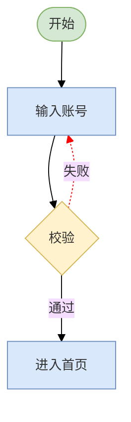

# 登录流程 · Markdown 文档里的画法（```mermaid）

同一张流程图，用**一个 Markdown 文档**画出来 —— 对照见 `README.md`（Mermaid / PlantUML / Graphviz / D2 / DrawAI 七档）。
内容与那一组完全一致：`开始 → 输入账号 → 校验 →（通过）进入首页 /（失败）回到输入账号`。
配色沿用 drawio 缺省调色板：绿 `#d5e8d4`、蓝 `#dae8fc`、黄 `#fff2cc`。

## 图



要点（与 `07-drawai.drawio` 逐项对齐）：

| 元素 | Markdown 里的写法 | 对应 drawio |
|---|---|---|
| 开始 | `start(["开始"])` + `classDef green` | `rounded=1;arcSize=50` 圆角胶囊 |
| 输入账号 / 进入首页 | `input["输入账号"]` + `classDef blue` | 蓝底矩形 |
| 校验 | `check{"校验"}` + `classDef yellow` | `rhombus=1` 菱形 |
| 通过 | `check -->\|通过\| home` | 实线 + 文字标签 |
| 失败（回环） | `check -.->\|失败\| input` | `dashed=1;strokeColor=red`，从左侧折回 |

## 这一档的定位

| | |
|---|---|
| 载体 | 就是这个 `.md` 文件本身 —— **源文件即文档**，没有单独的图源 |
| 可编辑性 | 改一行文字就是改图；但**改不了位置和连线走向**，布局全交给渲染器 |
| 观感 | 自动布局、直角折线、箭头规范，与 01-mermaid 同源 |
| 硬伤 | **GitHub 之外的多数离线查看器不认 ```mermaid** —— 没有渲染器时它就是一段代码块（见下） |

## 没有渲染器时会看到什么

上面那个围栏块会原样显示成代码。要落地成图片，本机**没装** `mmdc` / `dot` / `d2`，Chrome 也被沙箱拦住（Chrome 的 IPC 要开命名管道），
所以只能走 [Kroki](https://kroki.io) 公共渲染（把 fenced block 里的正文 deflate + base64url 后请求 `/svg`）：

> ⚠️ 与 `README.md` 同一笔代价：内容会发到 Kroki 公共服务器。示例图无所谓，真实架构图别这么走。

想自己渲：`npx -y @mermaid-js/mermaid-cli -i README-mermaid.md -o 08-mermaid-md.svg`（本机 npm 会 `EIDLETIMEOUT`，这条路待通）。

---

*纯 Markdown 表达，无外部源文件；渲染成品尚未落盘（缺 mmdc / 离线渲染器）。*
